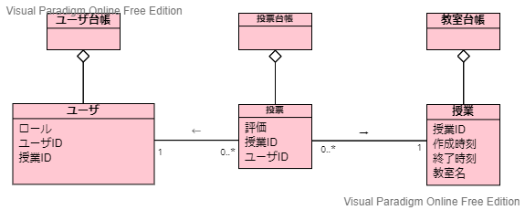
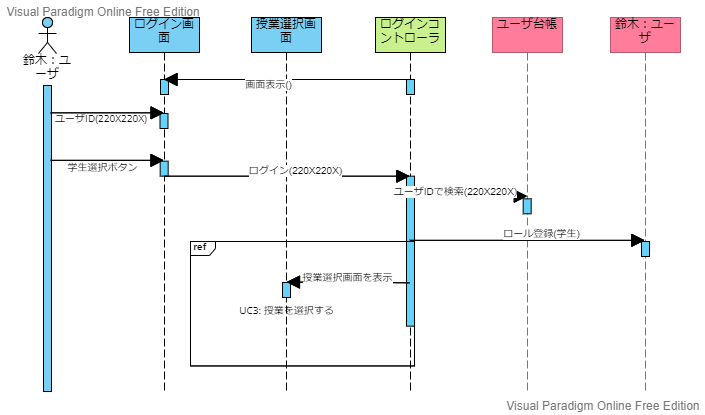

# 空調管理要求システム　オブジェクト指向分析

## 参照文書
---
- [要求仕様書](https://github.com/Seagull-N/software2022/blob/development/%E7%A9%BA%E8%AA%BF%E8%AA%BF%E7%AF%80%E8%A6%81%E6%B1%82%E3%82%B7%E3%82%B9%E3%83%86%E3%83%A0/%E8%A6%81%E6%B1%82%E4%BB%95%E6%A7%98%E6%9B%B8.md)

- [ユースケース](https://github.com/Seagull-N/software2022/blob/development/%E7%A9%BA%E8%AA%BF%E8%AA%BF%E7%AF%80%E8%A6%81%E6%B1%82%E3%82%B7%E3%82%B9%E3%83%86%E3%83%A0/usecase/README.md)

## 1. [モノ・コトを発見する]()
---
## 2. [仕事を発見する]()
---
## 3. [仕事を割り当てる]()
---
## 4. 成果物
---
### ドメインモデル図
---

### 分析レベルのシーケンス図
---
#### UC1: ログインする

#### UC2: 授業を作成する

#### UC3: 授業に入る

#### UC4: 投票する

#### UC5: 投票結果を確認する

