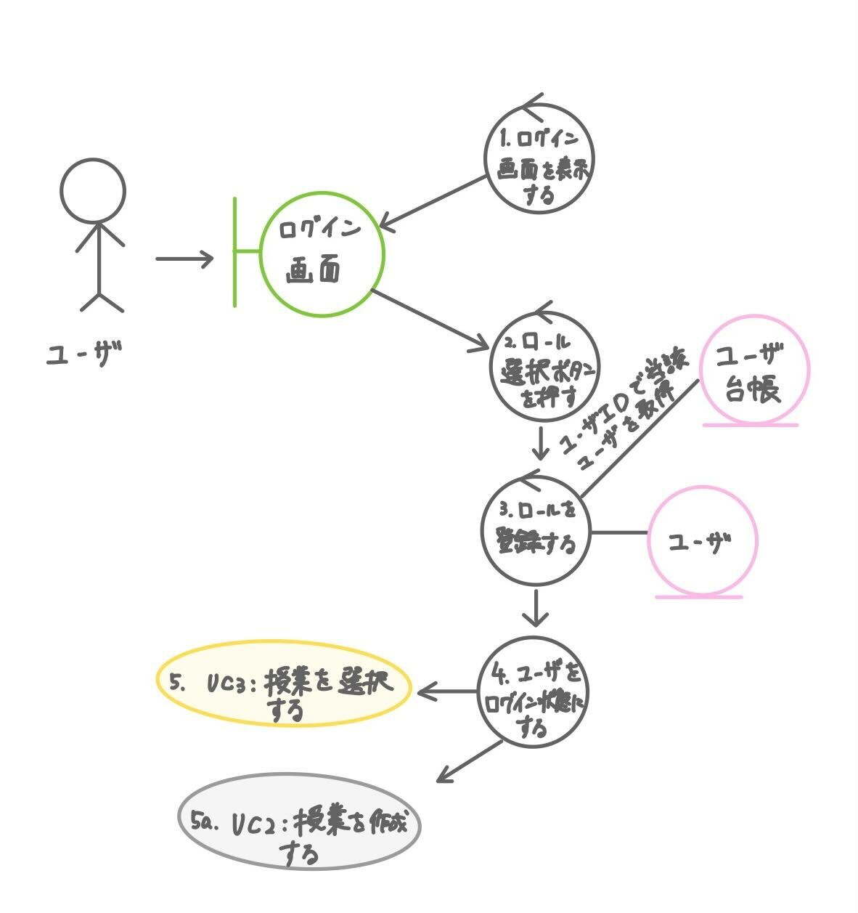
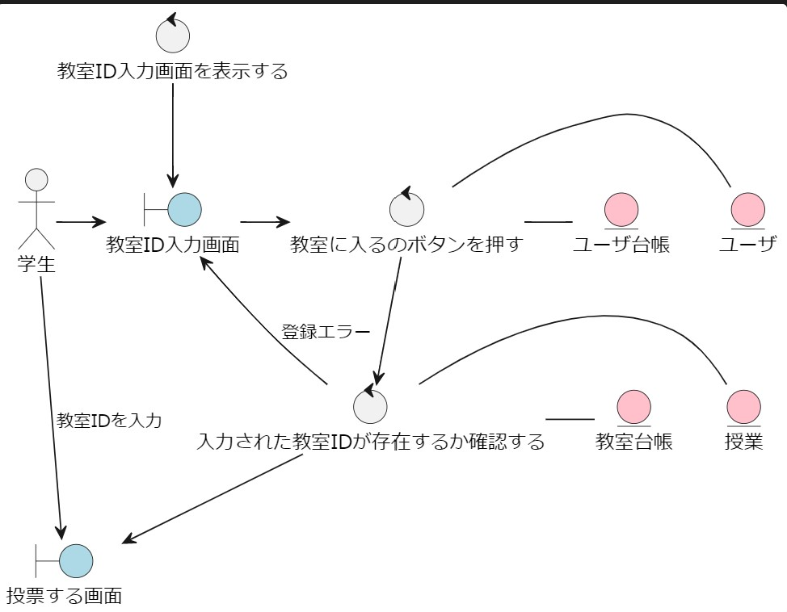

# 空調管理要求システム：ロバストネス分析
[戻る](README.md)
## ユースケース図
---

## 1. ログインする
---
- [ユースケース記述](../usecase/Usecase01.md)

## 2. 授業を作成する
---
- [ユースケース記述](../usecase/Usecase2.md)

## 3. 授業に入る
---
- [ユースケース記述](../usecase/Usecase3.md)

## 4. 投票する
---
- [ユースケース記述]()

## 5. 投票結果を確認する
---
- [ユースケース記述]()

