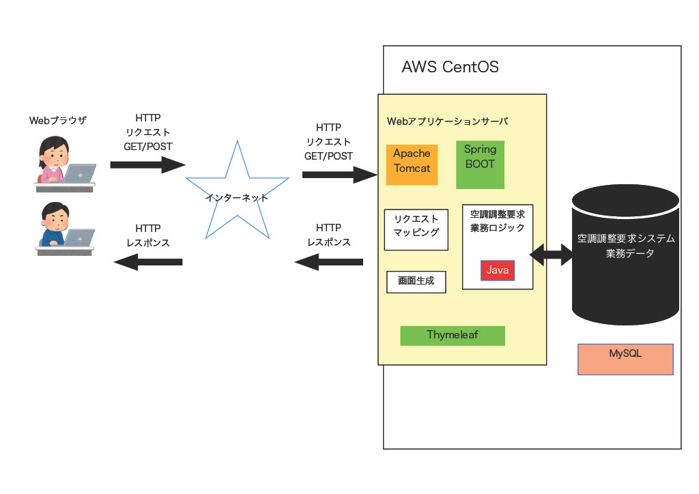
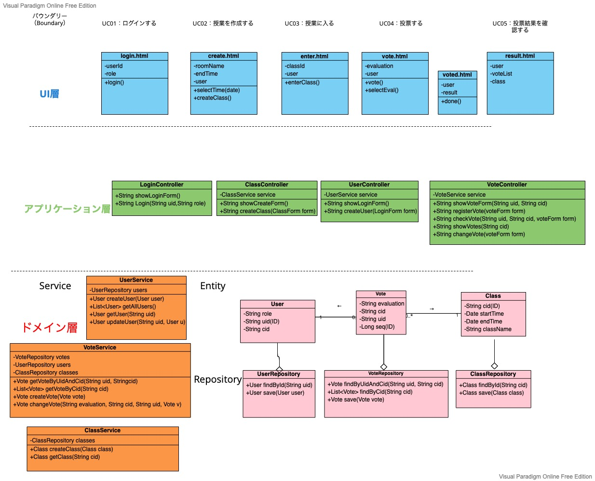

# 空調管理要求システム：オブジェクト指向設計

## システム・アーキテクチャ
会議室予約システムのシステムアーキテクチャを下に示す．

[要求仕様書](../requirement/README.md) からWebアプリケーションとして実現することが求められているため，以下の設計選択を行った．
- AWSに，Linux (CentOS)をインストール
- AWS上にApache Tomcat Webアプリケーションサーバと，MySQLデータベースサーバをインストール
- 空調管理要求システムの業務ロジックはJavaで実装する
- 業務データはMySQLに保存・管理する
- TomcatとJavaの連携は，Spring Bootフレームワークで行う
- 画面についてはテンプレートエンジンThymeleafを使い，サーバ内でHTMLを動的生成する

## 設計レベルのクラス図

以上をまとめて，設計レベルのクラス図を作成した．

