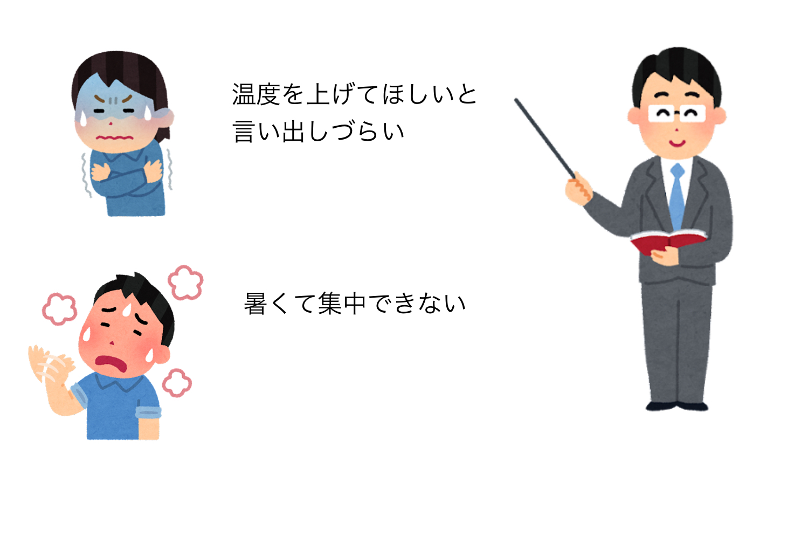
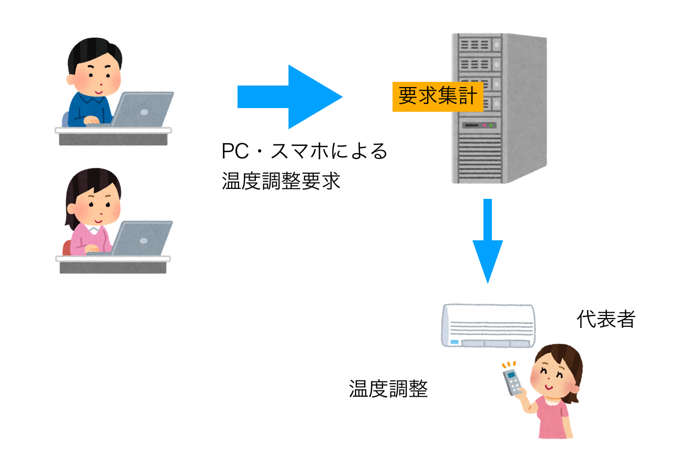

# 空調調節要求システム

## 1. システムの目的
---
授業中，寒さや暑さなどにより集中できないが，授業中のため言い出しにくいことがある．
　そこで本システムでは，匿名で空調に関する意見を投票形式で取ることで，スムーズな空調調節を行うことを目的とする．

## 2. システムの概要
---
本システムは、授業中における空調調節の決定を、匿名性を保持した投票で行うWebアプリケーションとして構築する。

下図(a)は、システム導入前の現状である。空調調節は生徒が教員に進言することで行われることが多いが、生徒は授業中なため、教員に言い出しにくいといった問題がある。

(a) システム導入前の現状

下図(b)は、システム導入後のあるべき姿である。空調調節要求システムは、生徒の寒さ、暑さに関連する意見を集約し、教員に可視化するWebアプリケーションとして実装する。教員は自身のPCやスマホでWebブラウザを開き、システムにログインすることで、教室内の生徒が空調の調節に関して要求していることを見ることが出来る。

(b) システム導入による効果

システムの導入によって、生徒は匿名で空調調節に関して、教員に提案することが可能になり、快適に講義に集中することが可能になる。

## 3. 機能一覧
---
空調管理システムを以下の機能を提供するWebアプリケーションとして実現する

### (1) ログイン機能
ユーザがシステムを利用する際のログインを行う機能. ログインはユーザIDで行う. 

### (2) ロール登録機能
ユーザがロール(教員、学生)を選択し, 登録する機能.

### (3)　授業作成機能
ログインした教員が, 授業の作成を行う機能.
授業の作成には, 
- 教室名
- 終了時刻
を入力する.

### (4) 授業選択機能
ログインした学生が, 授業を選択し, その授業に入る機能.

### (5) 投票機能
ログインした学生が, 温度に対する評価を投票する機能. 

### (6) 結果確認機能
ログインした教員が, 投票結果一覧を確認できる機能. 温度に対する評価を確認し, エアコンの温度管理に役立てる.
## 稼働開始時期
---
納期は八月、なお無理そうなら来年の八月
