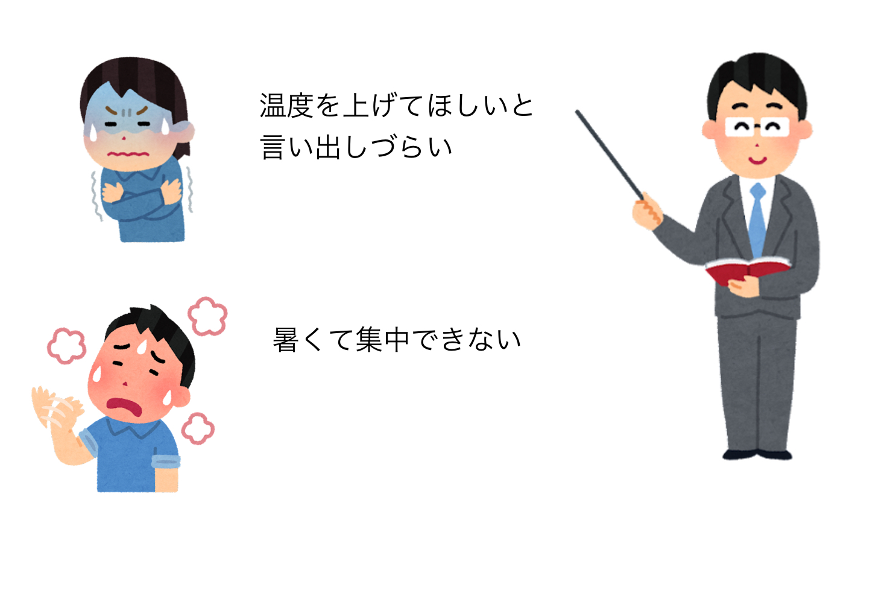
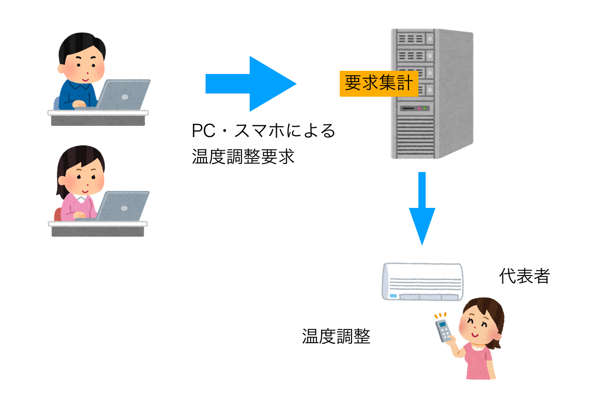

# 空調調節要求システム

## 1. システムの目的
授業中，寒さや暑さなどにより集中できないが，授業中のため言い出しにくいことがある．
　そこで本システムでは，匿名で空調に関する意見を投票形式で取ることで，スムーズな空調調節を行うことを目的とする．

## 2. システムの概要

(a) システム導入前の現状

(b) システム導入による効果

## 3. 機能一覧
空調管理システムを以下の機能を提供するWebアプリケーションとして実現する

- ユーザ管理機能：管理者を決定（登録する）機能
- 通知機能：管理者に通知を行う機能
- 要求集約機能：たまっている要求を集約する機能
- 意思表示機能：自分が感じている状態を投票する機能

シャイな人たちが寒暖差に影響受けることなく、授業に集中して取り組むことが無くなる。

## 稼働開始時期
納期は八月、なお無理そうなら来年の八月
